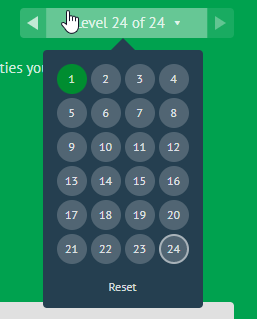

# LAB-04 part 2: Flexbox

- Today, your job is to explore and practice CSS flexbox by playing a fun game

## Lab Requirements
1. Go to [flexboxfroggy game](https://flexboxfroggy.com/)
2. Finish all the 24 levels
3. Use this cheat sheet to help you:  [CSS Flex Guide](https://css-tricks.com/snippets/css/a-guide-to-flexbox/#aa-basics-and-terminology)

## Submission Instructions
- Submit a clear screenshot of the level board with all the levels completed 
- What was the most challenging part when learning flexbox?

